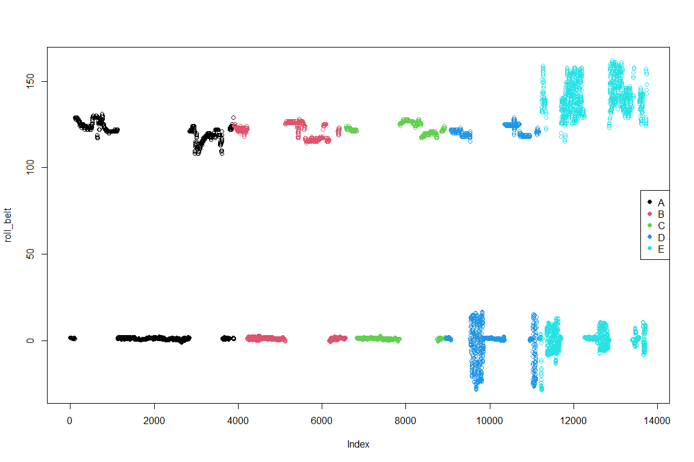
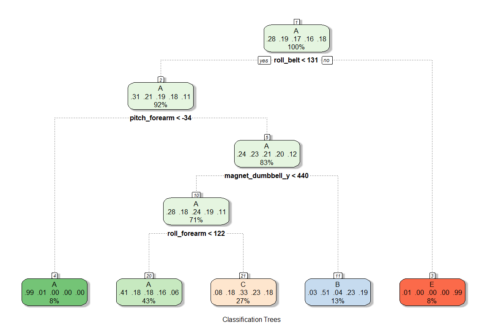

## Predicting the quality of execution of weight lifting exercises

### Overview

The objective of this project is to predict how well weight lifting exercises were performed according to the variables provided in the Weight Lifting Exercise Dataset [1]. This dataset contains a training set and a testing set. We will use cross-validation to build prediction models int the training set.

The project will be developed under the following R version, platform and packages versions:

        R version 4.0.2 (2020-06-22) -- "Taking Off Again"
        Platform: x86_64-w64-mingw32/x64 (64-bit)
        Caret package version: 6.0.86
        Rattle package version: 5.4.0

*[1] Velloso, E.; Bulling, A.; Gellersen, H.; Ugulino, W.; Fuks, H. Qualitative Activity Recognition of Weight Lifting Exercises. Proceedings of 4th International Conference in Cooperation with SIGCHI (Augmented Human '13) . Stuttgart, Germany: ACM SIGCHI, 2013.*

### Loading packages


```r
library(caret); library(rattle)
```

### Downloading and cleaning


```r
csv_training_url <- "https://d396qusza40orc.cloudfront.net/predmachlearn/pml-training.csv"
csv_test_url <- "https://d396qusza40orc.cloudfront.net/predmachlearn/pml-testing.csv"
download.file(csv_training_url, destfile = "./training.csv")
download.file(csv_test_url, destfile = "./test.csv")
training <- read.csv("./training.csv")
test <- read.csv("./test.csv")
dim(training);dim(test)
```

```
## [1] 19622   160
```

```
## [1]  20 160
```

We see that there are 160 potential variables to use for prediction. However, we can identify 3 types of variables that we want to not take into account when building the prediction models:

- Variables that reference the subjects and detail when the information was collected.
- Variables that have near zero variation.
- Variables that contains NAs. We will not use imputting techniques for this cases in this project.


```r
str(training, list.len=20)
```

```
## 'data.frame':	19622 obs. of  160 variables:
##  $ X                       : int  1 2 3 4 5 6 7 8 9 10 ...
##  $ user_name               : chr  "carlitos" "carlitos" "carlitos" "carlitos" ...
##  $ raw_timestamp_part_1    : int  1323084231 1323084231 1323084231 1323084232 1323084232 1323084232 1323084232 1323084232 1323084232 1323084232 ...
##  $ raw_timestamp_part_2    : int  788290 808298 820366 120339 196328 304277 368296 440390 484323 484434 ...
##  $ cvtd_timestamp          : chr  "05/12/2011 11:23" "05/12/2011 11:23" "05/12/2011 11:23" "05/12/2011 11:23" ...
##  $ new_window              : chr  "no" "no" "no" "no" ...
##  $ num_window              : int  11 11 11 12 12 12 12 12 12 12 ...
##  $ roll_belt               : num  1.41 1.41 1.42 1.48 1.48 1.45 1.42 1.42 1.43 1.45 ...
##  $ pitch_belt              : num  8.07 8.07 8.07 8.05 8.07 8.06 8.09 8.13 8.16 8.17 ...
##  $ yaw_belt                : num  -94.4 -94.4 -94.4 -94.4 -94.4 -94.4 -94.4 -94.4 -94.4 -94.4 ...
##  $ total_accel_belt        : int  3 3 3 3 3 3 3 3 3 3 ...
##  $ kurtosis_roll_belt      : chr  "" "" "" "" ...
##  $ kurtosis_picth_belt     : chr  "" "" "" "" ...
##  $ kurtosis_yaw_belt       : chr  "" "" "" "" ...
##  $ skewness_roll_belt      : chr  "" "" "" "" ...
##  $ skewness_roll_belt.1    : chr  "" "" "" "" ...
##  $ skewness_yaw_belt       : chr  "" "" "" "" ...
##  $ max_roll_belt           : num  NA NA NA NA NA NA NA NA NA NA ...
##  $ max_picth_belt          : int  NA NA NA NA NA NA NA NA NA NA ...
##  $ max_yaw_belt            : chr  "" "" "" "" ...
##   [list output truncated]
```


```r
ref <- 1:7
nzv <- nearZeroVar(training, saveMetrics = TRUE)
nzvTrue <- which(nzv$nzv=="TRUE")        
nas <- which(colSums(is.na(training))>0)
deletedVariables <- unique(c(ref,nzvTrue,nas))
trainingClean <- training[,-deletedVariables]
testClean <- test[,-deletedVariables]
dim(trainingClean);dim(testClean)
```

```
## [1] 19622    53
```

```
## [1] 20 53
```

We will use 53 of the 160 variables available to build our prediction models.

### Creating validation set

Now that we have our training and testing sets cleaned we will split the training set in two new sets: one for building the models and another one to validate them. Test set will be reserved to use only once when the final model is selected.


```r
set.seed(1234)
inBuild <- createDataPartition(y=trainingClean$classe, p=0.7,list=FALSE)
building <- trainingClean[inBuild,]
validation <- trainingClean[-inBuild,]
dim(building);dim(validation)
```

```
## [1] 13737    53
```

```
## [1] 5885   53
```

### Exploratory data analysis


```r
table(building$classe)/(length(building$classe))*100
```

```
## 
##        A        B        C        D        E 
## 28.43416 19.34920 17.44195 16.39368 18.38101
```

All performance types of classes have similar proportions except for class A that has some more observations.


```r
plot(building[,1], col = factor(building$classe), ylab = names(building)[1])
legend("right",legend=unique(factor(building$classe)),
       col=1:5, pch = 19)
```

<!-- -->

Taking the first variable of the building set, we see in the plot above that the variability is not enough to distinguish clearly the classes. We could continue with techniques like clustering and SVD to see if we can identify how to classify the classes of performance. Since this is not the scope of the project we will pass directly to constructing prediction models that will help us with this.

### Prediction models

**Classification Trees**

The first model that we will try is classification trees.


```r
set.seed(1234)
modFit1 <- train(classe~., method="rpart", data=building) 
```

```r
fancyRpartPlot(modFit1$finalModel, sub="Classification Trees")
```

<!-- -->

The model gives us some ideas of variables that would be useful to classify the type of performance but the final leaves are not as we would expected (class D is missing). We will test its accuracy in the validation set.


```r
pred1 <- predict(modFit1, newdata=validation)
cm1 <- confusionMatrix(pred1, factor(validation$classe))
cm1$overall[1]
```

```
##  Accuracy 
## 0.4937978
```

The accuracy of this model is very low. We will try now a random forest model.

**Random Forest**


```r
set.seed(1234)
modFit2 <- train(classe~., method="rf", data=building, 
                 trControl=trainControl(method="cv", number=3))
modFit2
```

```
## Random Forest 
## 
## 13737 samples
##    52 predictor
##     5 classes: 'A', 'B', 'C', 'D', 'E' 
## 
## No pre-processing
## Resampling: Cross-Validated (3 fold) 
## Summary of sample sizes: 9159, 9158, 9157 
## Resampling results across tuning parameters:
## 
##   mtry  Accuracy   Kappa    
##    2    0.9874064  0.9840668
##   27    0.9897361  0.9870150
##   52    0.9806370  0.9755000
## 
## Accuracy was used to select the optimal model using the largest value.
## The final value used for the model was mtry = 27.
```

```r
pred2 <- predict(modFit2, newdata=validation)
cm2 <- confusionMatrix(pred2, factor(validation$classe))
cm2$overall[1]
```

```
## Accuracy 
## 0.993373
```

```r
varImportance <- varImp(modFit2)
varImportance
```

```
## rf variable importance
## 
##   only 20 most important variables shown (out of 52)
## 
##                      Overall
## roll_belt             100.00
## pitch_forearm          59.75
## yaw_belt               54.36
## roll_forearm           45.28
## magnet_dumbbell_z      44.61
## magnet_dumbbell_y      44.24
## pitch_belt             44.24
## accel_dumbbell_y       23.44
## roll_dumbbell          19.09
## accel_forearm_x        17.46
## magnet_dumbbell_x      16.28
## magnet_belt_z          15.10
## magnet_forearm_z       15.04
## magnet_belt_y          14.49
## accel_dumbbell_z       14.01
## accel_belt_z           13.79
## total_accel_dumbbell   13.34
## gyros_belt_z           11.60
## yaw_arm                10.51
## magnet_belt_x          10.18
```

The random forest with 3 fold cross-validation presents a much more higher accuracy than the classiication trees. Although we could just accept this model and test it in the testing set we will try a boosting model.

**Boosting**


```r
set.seed(1234)
modFit3 <- train(classe~., method="gbm", data=building, 
                 trControl=trainControl(method="cv", number=3), verbose=FALSE)
modFit3
```

```
## Stochastic Gradient Boosting 
## 
## 13737 samples
##    52 predictor
##     5 classes: 'A', 'B', 'C', 'D', 'E' 
## 
## No pre-processing
## Resampling: Cross-Validated (3 fold) 
## Summary of sample sizes: 9159, 9158, 9157 
## Resampling results across tuning parameters:
## 
##   interaction.depth  n.trees  Accuracy   Kappa    
##   1                   50      0.7516931  0.6851589
##   1                  100      0.8224515  0.7753222
##   1                  150      0.8525159  0.8133518
##   2                   50      0.8579028  0.8199982
##   2                  100      0.9039099  0.8783724
##   2                  150      0.9295339  0.9108244
##   3                   50      0.8970671  0.8697069
##   3                  100      0.9380512  0.9216162
##   3                  150      0.9585065  0.9475037
## 
## Tuning parameter 'shrinkage' was held constant at a value of 0.1
## 
## Tuning parameter 'n.minobsinnode' was held constant at a value of 10
## Accuracy was used to select the optimal model using the largest value.
## The final values used for the model were n.trees = 150, interaction.depth =
##  3, shrinkage = 0.1 and n.minobsinnode = 10.
```

```r
pred3 <- predict(modFit3, newdata=validation)
cm3 <- confusionMatrix(pred3, factor(validation$classe))
cm3$overall[1]
```

```
##  Accuracy 
## 0.9680544
```

The boosting with 3 fold cross-validation presents also a much more higher accuracy level than the classification trees but less than random forest.

**Models comparison**


```r
data.frame(Model=c("Classification trees","Random forest", "Boosting"), Accuracy=c(cm1$overall[1],cm2$overall[1],cm3$overall[1]),
OutSampleError=c((1-cm1$overall[1]),(1-cm2$overall[1]),(1-cm3$overall[1])))
```

```
##                  Model  Accuracy OutSampleError
## 1 Classification trees 0.4937978    0.506202209
## 2        Random forest 0.9933730    0.006627018
## 3             Boosting 0.9680544    0.031945624
```

From the table above we can identify that the random forest model has the higher level of accuracy. Although we can try stacking models, due to the level of accuracy that we obtained with the random forest model we will not try this. We select the random forest model to test it on the testing set.

Since the testing set does not provide the *classe* variable, we will estimate the out sample error as the one obtained in the validation set for the random forest model selected. The out sample error is: 0.663%.

### Results of the prediction on the testing set


```r
predTesting <- predict(modFit2, newdata=testClean)
predTesting
```

```
##  [1] B A B A A E D B A A B C B A E E A B B B
## Levels: A B C D E
```

### Conclusions

We tried three different prediction models to predict how well weight lifting exercises were performed. Among those, the random forest model presented a low out sample error when tested in the validation set and hence we are confident that given a new set the model will accuratly predict the quality of execution of weight lifting exercises.
